# Monotonic Gaussian Processes Since 2010

## Executive summary

Jaakko Riihimäki and Aki Vehtari’s 2010 paper established the modern machine-learning baseline for monotonic Gaussian processes by introducing **virtual derivative observations** and approximating the resulting non-Gaussian posterior with **expectation propagation**. That idea remains influential because it is conceptually simple, can be layered onto standard GP regression/classification, and directly uses the fact that GP derivatives are jointly Gaussian with the latent function. But it also exposes the central tradeoff in this area: enforcing monotonicity through pseudo-observations is easy to retrofit, yet it gives only **pointwise or discretized control** unless virtual points are made dense, and its computational cost grows with both data and constraint points. citeturn6search0turn5search5turn18view0turn34search19

Since 2010, the literature has diversified into several distinct families. One lineage extends Riihimäki’s idea with derivative-sign observations, MCMC, automatic monotonicity detection, preference learning, Bayesian optimization, and more efficient samplers. A second lineage replaces virtual derivative signs with **projection or shape-constrained priors**, giving stronger global monotonicity guarantees and, in some cases, posterior contraction theory. A third lineage uses **finite-dimensional constrained bases** or **linear operator inequality constraints**, which can enforce monotonicity **everywhere** on the domain and now scales much better than the earliest constrained-GP constructions. A fourth lineage builds monotonicity **by construction** through flows, transformed priors, or specialized kernels. A fifth uses softer probabilistic constraints when exact shape restriction is too rigid or too expensive. citeturn7search3turn25view0turn19view5turn19view1turn20view1turn18view2turn18view1turn14search1turn15search3turn35search2

The strongest theoretical results today are **not** attached to Riihimäki-style EP. They are strongest for **projection methods** and for **finite-dimensional constrained approximations**. Lin and Dunson proved continuity of the projection and posterior contraction rates for GP projection; Bachoc, Lagnoux, and López-Lopera proved that unconstrained and constrained MLEs have the same fixed-domain asymptotic distribution under inequality constraints; and Bachoc, López-Lopera, and Roustant proved convergence of the MaxMod algorithm and convergence of finite-dimensional constrained GPs even when knots are not dense. By contrast, EP-based virtual-derivative methods, monotonic GP flows, and newer soft-constraint samplers are empirically compelling but still comparatively light on formal consistency and uncertainty-calibration guarantees. citeturn19view5turn9search2turn31view0turn32view0turn29academia21turn35search2turn27search18

From an implementation point of view, the most mature monotonic-GP software remains in **MATLAB/Octave and R**, especially **GPstuff**, **lineqGPR**, and **constrKriging**. Python support exists, but it is more fragmented and often attached to particular papers, such as **monotonic_flow**, **gp_constr**, and the recent **Paper-FMGP** repository for faster monotonic GP sampling. For researchers, the practical choice is usually clear: use virtual-derivative methods when you want the closest extension of an existing GP model; use constrained finite-dimensional or additive/block-additive methods when you need **global guarantees**; use monotone-by-construction transformations when you want **expressive priors** in one dimension or structured hierarchical warps; and reserve soft constraints for cases where exact monotonicity is more a preference than a law. citeturn6search5turn5search19turn34search15turn5search3turn36search1turn37search5turn37search0

## From virtual derivatives to a broader design space

Riihimäki and Vehtari’s original construction introduces monotonicity information through **virtual derivative observations**, then uses **EP** to approximate the posterior induced by those derivative constraints in GP regression and classification. In hindsight, that paper did two things at once: it made monotonicity practical for ML users, and it also made visible the structural weakness of pseudo-observation methods — monotonicity is represented through a **finite set of operational points**, so global control depends on placement and density of those points. Later papers repeatedly either refined that idea or deliberately moved away from it. citeturn6search0turn5search5turn18view0turn19view3

A useful way to organize the field is as a taxonomy of **where the constraint lives**. Some methods place monotonicity in the **likelihood** through derivative-sign or soft-constraint terms. Some place it in the **prior support** via projection, squared-derivative constructions, or monotone flows. Others place it in a **finite-dimensional surrogate representation**, where monotonicity becomes linear inequalities on basis coefficients. And still others encode it through **operator constraints** or **specialized kernels/warpings** that make monotone behavior natural or exact for specific tasks. citeturn23view0turn19view5turn20view1turn18view2turn18view1turn15search3turn35search2

The diagram below summarizes that synthesis across the post-2010 literature. It is a schematic of the main methodological branches rather than a claim that every paper falls cleanly into a single box. citeturn6search0turn25view0turn23view0turn19view1turn20view1turn18view2turn18view1turn14search1turn35search2

```mermaid
flowchart TD
    A[Riihimäki and Vehtari 2010<br/>virtual derivative observations + EP]

    A --> B[Virtual derivative or finite-point constraint methods]
    A --> C[Projection and constrained-prior methods]
    A --> D[Finite-dimensional constrained bases]
    A --> E[Linear operator inequality constraints]
    A --> F[Monotone-by-construction transforms and kernels]
    A --> G[Soft probabilistic constraints]

    B --> B1[Golchi et al. 2015<br/>MCMC monotone emulation]
    B --> B2[Wang and Berger 2016<br/>derivative-process Gibbs sampling]
    B --> B3[Siivola et al. 2016<br/>automatic monotonicity detection]
    B --> B4[Chin et al. 2018<br/>preference learning]
    B --> B5[Tran et al. 2023<br/>materials science]
    B --> B6[Zhang et al. 2026<br/>NUTS and RLRTO]

    C --> C1[Lin and Dunson 2014<br/>GP projection]
    C --> C2[Lenk and Choi 2017<br/>squared-derivative shape priors]

    D --> D1[Maatouk and Bay 2017]
    D --> D2[López-Lopera et al. 2018]
    D --> D3[Bachoc et al. 2022<br/>MaxMod]
    D --> D4[López-Lopera et al. 2022<br/>additive constrained GPs]
    D --> D5[Deronzier et al. 2026<br/>block-additive constrained GPs]
    D --> D6[Maatouk et al. 2025<br/>large-scale sampling]

    E --> E1[Da Veiga and Marrel 2012 and 2020]
    E --> E2[Agrell 2019]
    E --> E3[Benavoli and Azzimonti 2024<br/>LCGP as SkewGP]

    F --> F1[Ustyuzhaninov et al. 2020<br/>monotonic GP flows]
    F --> F2[Barnett et al. 2025<br/>monotonic warpings]
    F --> F3[Murphy et al. 2026<br/>dissolution spline kernel]

    G --> G1[Kochan and Yang 2025<br/>soft inequality and monotonicity]
```

Two strategic facts stand out from that taxonomy. First, the field has steadily moved from **local, approximate enforcement** toward **global, everywhere-valid enforcement** whenever applications demand physical realism or scientific interpretability. Second, scalability has come less from one universal approximation scheme than from **structural restrictions**: additive decompositions, block-additive decompositions, linear-cost selection criteria, subdomain methods, circulant embedding, and faster constrained samplers. citeturn19view1turn20view1turn32view0turn18view3turn20view2turn33search2turn29academia21

## Comparative map of major methods

The table below emphasizes representative papers from 2010 onward that either extend Riihimäki’s virtual-derivative strategy or sharply contrast with it.

| Year | Authors and paper | Core approach | Inference | Scalability profile | Main advantages | Main limitations | Code availability |
|---|---|---|---|---|---|---|---|
| 2010 | **Riihimäki & Vehtari** — *Gaussian processes with monotonicity information* citeturn6search0turn5search5 | Virtual derivative observations at selected points | EP | Cubic in data plus virtual points; operationally simple but does not scale well with many pseudo-points | Natural extension of standard GP regression/classification; easy to understand; influential baseline | Monotonicity is enforced through finitely many virtual points, so global behavior depends on point placement and density | **Yes** through **GPstuff**’s monotonicity support citeturn6search5turn5search19 |
| 2012 | **Da Veiga & Marrel** — *Gaussian process modeling with inequality constraints* citeturn35search11turn22search18 | General linear inequality constraints via discretization and truncated-normal calculations | Numerical integration, correlation-free approximations, sampling techniques | Weak in high dimension because discretization grows quickly | Broad and flexible formulation covering bounds, monotonicity, convexity, and general linear constraints | Suffers from curse of dimensionality as the number of constraint locations grows | No official package linked from the paper sources located here |
| 2014 | **Lin & Dunson** — *Bayesian monotone regression using Gaussian process projection* citeturn19view5 | Posterior-sample projection onto the monotone cone | Posterior sampling followed by projection | Good for low/moderate dimensions; not presented as a high-dimensional scalable solution | Clean monotone support; strong theory on continuity and contraction | Projection is post hoc; computation and projection geometry become harder in higher dimensions | No mature official package located in the paper sources here |
| 2015 | **Golchi, Bingham, Chipman & Campbell** — *Monotone Emulation of Computer Experiments* citeturn25view0turn24search3 | Bayesian monotone emulation with derivative-based constraints | MCMC | Better suited to small or moderate design sizes than large-scale problems | Developed explicitly for computer experiments; gave a practical Bayesian alternative to EP | Sampling burden increases with constrained latent dimension; still tied to discretized monotonicity information | No official public package found in the source pages here |
| 2016 | **Wang & Berger** — *Estimating Shape Constrained Functions Using Gaussian Processes* citeturn23view0 | Derivative-process formulation for shape constraints | Gibbs sampling | Primarily small to moderate problem sizes | General shape-constrained formulation; concrete real-data emulation examples | Computationally intensive; monotonicity still represented through derivative-based constraints | No official package linked from the article page |
| 2016 | **Siivola, Piironen & Vehtari** — *Automatic monotonicity detection for Gaussian Processes* citeturn7search3turn7search0 | Uses virtual derivative observations to **detect** monotone directions from data | Model comparison / approximate GP inference | Practical screening tool rather than a scalable regression engine | Useful for deciding which inputs should be constrained before fitting a monotone GP | Detection is not the same as guaranteed enforcement; paper is an arXiv preprint rather than a major venue publication | Partial support through GPstuff-related code ecosystem citeturn7search10turn6search3 |
| 2017 | **Maatouk & Bay** — *Gaussian Process Emulators for Computer Experiments with Inequality Constraints* citeturn19view1 | Finite-dimensional GP basis with coefficient constraints that satisfy monotonicity everywhere | Conditional simulation, posterior mean/mode, uncertainty intervals | Much better than dense-grid truncation in low/moderate dimensions | Global constraints hold **everywhere**; interpretable basis-coefficient formulation | Original formulation still not large-scale | **Yes** through **constrKriging** citeturn5search3turn5search11 |
| 2018 | **López-Lopera, Bachoc, Durrande & Roustant** — *Finite-Dimensional Gaussian Approximation with Linear Inequality Constraints* citeturn20view1turn21search5 | Extends Maatouk–Bay to sets of linear inequalities | MCMC, with HMC highlighted as efficient | Better than earlier constrained discretizations but still not designed for hundreds of dimensions | Handles monotonicity, convexity, boundedness, and broader linear inequality families; emphasizes efficient UQ | Still finite-dimensional and sampler-based; scalability depends on basis size | **Yes** through **lineqGPR** citeturn34search15turn36search0 |
| 2018 | **Chin et al.** — *Gaussian Processes with Monotonicity Constraints for Preference Learning from Pairwise Comparisons* citeturn8search3turn13search13 | Extends monotonic constraints to utility learning from pairwise data | Constrained GP optimization / Bayesian preference learning | Small to moderate dimensional utilities | Shows monotonicity is valuable beyond regression, especially in utility/preference settings | Custom formulation with limited general-purpose software impact | **Yes** — MATLAB research code citeturn36search15turn37search2 |
| 2019 | **Agrell** — *Gaussian Processes with Linear Operator Inequality Constraints* citeturn18view2turn34search19 | Linear operator constraints enforced using sufficiently dense virtual observation locations | Exact posterior for conjugate likelihoods plus efficient sampling | More numerically principled than earlier discretization approaches; still depends on constraint set size | Unified operator view covers boundedness, monotonicity, convexity, and more | “Everywhere” claims rely on dense operational-point placement and kernel/operator structure | **Yes** — Python **gp_constr** citeturn37search5 |
| 2020 | **Ustyuzhaninov et al.** — *Monotonic Gaussian Process Flows* citeturn18view1turn15search7 | Monotone functions generated by numerical solutions of stochastic differential equations | Elliptical slice sampling | Most natural in one-dimensional monotone components; not a general high-dimensional solver | Monotonicity by construction; interpretable hierarchical priors; useful for temporal alignment/warping | Computational burden from non-analytic calculations; theory lighter than projection/basis-constraint methods | **Yes** — Python/Jupyter code citeturn36search1 |
| 2020 | **Da Veiga & Marrel** — *Gaussian process regression with linear inequality constraints* citeturn34search1turn34search11 | General linear constraints using discretized input space and truncated-normal expectations | Conditional expectation methods | Demonstrated up to about 20 variables, but explicitly notes curse-of-dimensionality issues | Broad constraint family; practical comparisons on several analytic examples | Discrete-location approximation becomes expensive in high dimension | No official package found from the article page |
| 2020 | **Ray, Pati & Bhattacharya** — *Efficient Bayesian shape-restricted function estimation with constrained Gaussian process priors* citeturn12search0turn12search4 | Efficient constrained posterior sampling for shape-restricted finite-dimensional GP approximations | Smooth-relaxed likelihood plus circulant embedding | Better than naive constrained sampling for larger problems | Strong computational focus; revisits shape restriction with more scalable posterior sampling | Still not a mainstream ML implementation; relies on finite-dimensional approximation | No official package page found in the queried sources |
| 2022 | **Bachoc, López-Lopera & Roustant** — *Sequential Construction and Dimension Reduction of Gaussian Processes Under Inequality Constraints* citeturn32view0 | **MaxMod** sequential knot insertion and dimension reduction | Optimization plus constrained GP fitting | Efficient at least to dimension 20, with fewer knots than prior constrained GP models | Proves convergence; attacks the core knot-allocation bottleneck | Still assumes a constrained finite-dimensional GP backbone | Supported by the broader **lineqGPR** ecosystem citeturn34search15turn36search0 |
| 2022 | **López-Lopera, Bachoc & Roustant** — *High-dimensional Additive Gaussian Processes under Monotonicity Constraints* citeturn18view3turn36search3turn36search8 | Additive constrained GP prior with componentwise monotonicity and MaxMod | Constrained additive GP inference | Strongest high-dimensional result to date in this family; examples in hundreds of dimensions and up to dimension 1000 in the paper overview | Global monotonicity everywhere, linear-cost criterion, open-source code, real flood application | Additivity reduces flexibility when interactions matter | **Yes** — open-source code reported by the paper; implemented through the authors’ toolbox ecosystem citeturn36search8turn36search0 |
| 2023 | **Tran, Maupin & Rodgers** — *Monotonic Gaussian Process for Physics-Constrained Machine Learning With Materials Science Applications* citeturn17search17turn17search5 | Application of monotonic GP constraints to scarce, noisy materials data | Constrained GP inference | Application scale rather than a new asymptotic solver | Shows monotonicity can substantially reduce posterior variance in materials applications | More of an application paper than a generic algorithmic advance | No official general-purpose software linked from the sources queried |
| 2024 | **Benavoli & Azzimonti** — *Linearly Constrained Gaussian Processes are SkewGPs* citeturn19view3turn13search4turn17search14 | Recasts finite-point linearly constrained GPs as **SkewGPs**; extends to monotonic preference learning and desirability | Closed-form skew-GP machinery | Moderate scale; aimed at richer likelihood structures rather than massive data | Unifies regression, preference learning, and desirability; reports better accuracy and UQ than monotonic GP flow on 1D benchmarks | Constraint set still finite-point based unless further structure is imposed | No official implementation page was surfaced by the paper page search |
| 2025 | **Barnett et al.** — *Monotonic warpings for additive and deep Gaussian processes* citeturn14search1turn14search8 | Monotone GP construction used as additive monotone components or latent warpings in deep GPs | Elliptical slice sampling | Efficient in 1D monotone blocks; useful as a module inside larger models | Elegant bridge from monotone priors to nonstationary additive/deep GP modeling | Less mature theory and software than constrained-basis methods | No official package surfaced in the queried sources |
| 2025 | **Maatouk, Rullière & Bay** — *Large-scale constrained Gaussian processes for shape-restricted function estimation* citeturn20view2 | Large-scale sampling for constrained finite-dimensional GPs using domain decomposition and cross-correlation ideas | Improved posterior sampling | Explicitly designed to reduce complexity for large Gaussian vectors | Important scalability step for everywhere-constrained GPs | Still tied to finite-dimensional approximation quality | No official package page surfaced in the queried sources |
| 2025 | **Kochan & Yang** — *Gaussian Process Regression with Soft Inequality and Monotonicity Constraints* / Frontiers journal version citeturn35search2turn35search0 | Soft probabilistic inequality and monotonicity constraints | QHMC | Presented as applicable to high-dimensional problems | Useful when strict shape enforcement is too rigid; improved accuracy and variance in experiments | Constraints are soft rather than exact; theory is light | No official software page surfaced in the queried sources |
| 2026 | **Deronzier et al.** — *Block-Additive Gaussian Processes under Monotonicity Constraints* citeturn33search1turn33search2 | Extends additive monotone GPs to interactions through blocks while keeping tractable constraints | Constrained block-additive fitting with MaxMod-based model selection | Examples up to dimension 120 and real 5D coastal flooding | A major step beyond purely additive structure; better match when monotone variables interact | Still structured and not fully general non-additive GP regression | No software page surfaced in the queried sources |
| 2026 | **Zhang, Everink & Jørgensen** — *Efficient monotonic Gaussian processes via Randomize-then-Optimize* / *Fast Gaussian Processes under Monotonicity Constraints* citeturn21search14turn29academia21turn37search6 | Virtual-point monotonic GP with **RLRTO**, plus NUTS upgrades to earlier samplers | RLRTO and NUTS | Strong computational improvement; synthetic and differential-equation surrogates | Keeps the virtual-point flavor but modernizes sampling; reports major runtime gains with comparable accuracy | Global monotonicity still depends on virtual-point design unless combined with denser or structured placements | **Yes** — Python **Paper-FMGP** repository citeturn37search0 |

A pattern is visible across that table. Methods closest to Riihimäki’s original design are easiest to retrofit into standard GP pipelines, but the papers with the strongest **everywhere-monotone guarantees** are the finite-dimensional constrained-basis and structured additive/block-additive methods. Recent work in 2024–2026 has tried to close the gap by either reinterpreting finite-point constrained GPs through richer distributions such as SkewGPs or by making pseudo-point methods sample much faster. citeturn19view3turn20view2turn33search2turn29academia21

## Theory, guarantees, and uncertainty quantification

Theoretical coverage is uneven across the literature. The clearest monotone-GP theory begins with **GP projection**. Lin and Dunson’s projection framework proves continuity of the projection map and gives **posterior contraction rates**, which is still one of the strongest formal Bayesian guarantees attached to a monotone GP construction. Their core idea is that an unconstrained GP posterior can be projected into the monotone space in a way that preserves useful asymptotic control. citeturn19view5

A second substantial theoretical line comes from **finite-dimensional constrained approximations**. López-Lopera et al. showed that the Maatouk–Bay finite-dimensional model can satisfy inequality constraints everywhere, extended it to general linear inequalities, and studied theoretical and numerical properties of a **constrained likelihood** for covariance estimation. Bachoc, López-Lopera, and Roustant later proved convergence of the **MaxMod** sequential construction and also proved convergence of constrained finite-dimensional GPs when the knots are not dense, which is important because practical scalable methods cannot afford very dense knot sets. citeturn20view1turn32view0

The asymptotic behavior of covariance estimation under constraints is especially well understood. Bachoc, Lagnoux, and López-Lopera showed that under fixed-domain asymptotics, the unconstrained MLE and the constrained MLE have the **same asymptotic distribution**, both unconditionally and conditionally on the process satisfying inequality constraints such as monotonicity; their simulations also found constrained MLE to be often more accurate in finite samples. This result matters because many practitioners worry that imposing monotonicity might distort kernel hyperparameter learning in unpredictable ways. That concern is not borne out in their asymptotic analysis. citeturn9search2

Uncertainty quantification improves in several constrained-GP papers, but in different senses. Riihimäki-style models often reduce edge variance and extrapolation instability when monotonicity is genuinely present. Finite-dimensional constrained approximations were explicitly motivated by the claim that constraints lead to **more realistic uncertainties**, and later Bayesian-analysis work on constrained GPs emphasizes improved prediction and more realistic credible intervals. Application papers in materials science and dissolution testing also report that monotonicity reduces posterior variance and improves physically plausible uncertainty bands. citeturn6search0turn20view1turn9search10turn17search17turn20view3

By contrast, the strongest formal guarantees are still limited for three popular families: **EP with virtual derivative signs**, **monotonic GP flows**, and **soft-constraint samplers**. Those methods have strong empirical case studies and sometimes elegant constructions, but the queried primary sources do not provide the same level of consistency, posterior contraction, or calibrated-UQ theory that projection and constrained finite-dimensional approaches do. More broadly, while general GP variational Bayes now has posterior-contraction theory for inducing-variable approximations, monotonic-GP-specific variational guarantees remain scarce. citeturn18view1turn35search2turn27search18

A useful practical summary is this: if you need the strongest current theory, choose **projection** or **finite-dimensional constrained approximations**; if you need the most plug-compatible method with standard GP workflows, choose **virtual derivative points**; and if you need richer priors for monotone latent variables or warpings, choose **monotone flows or transformations**, but accept that the theoretical toolbox is thinner. citeturn19view5turn20view1turn6search0turn18view1turn14search1

## Computation, scalability, software, and benchmarks

Scalability has become the central engineering problem in monotonic GPs because every strategy adds extra latent structure. In Riihimäki-style models, the augmented latent state includes function values plus derivative-related variables at virtual points, so computation gets harder as monotonicity is enforced more densely. One important enabling result, although not itself a monotonicity paper, is Eriksson et al.’s extension of **SKI/SKIP to derivative information**, which yields **O(nd)** learning and **O(1)** prediction per test point under their approximation scheme. That result is directly relevant because derivative-based monotone GP methods inherit the same algebraic bottlenecks as derivative-observation GPs. citeturn6search0turn26search14

The most important monotonicity-specific scalability advances came from **structure**, not generic sparse inducing-point variational inference. Bachoc et al.’s MaxMod method attacks knot allocation and dimension reduction; López-Lopera et al. turned that into an **additive constrained GP** framework with a linear-cost criterion and examples in hundreds of dimensions; Deronzier et al. generalized it to **block-additive** structure to recover certain interactions while retaining tractability; and Maatouk, Rullière, and Bay used subdomain decomposition and cross-correlated sampling ideas to make large constrained Gaussian vectors much cheaper to sample. citeturn32view0turn18view3turn33search2turn20view2

Recent work has also modernized sampling. Monotonic GP Flows uses **elliptical slice sampling** for transformed monotone processes. Maatouk and coauthors revisited constrained GP approximation with ESS in 2025. Zhang, Everink, and Jørgensen then brought **NUTS** and **RLRTO** into the virtual-point constrained-GP setting and reported that RLRTO substantially outperformed the compared samplers in computational efficiency while preserving comparable predictive accuracy. The within-family message is notable: instead of abandoning virtual derivative points, one can dramatically improve them by replacing older constrained samplers. citeturn15search7turn29search0turn29search3turn29academia21turn37search3

The software ecosystem reflects those branches.

| Package | Language | What it implements | Notes |
|---|---|---|---|
| **GPstuff** citeturn6search5turn6search2 | MATLAB / Octave | General GP toolbox with **monotonicity information (EP only)**, derivative observations, multiple sparse approximations, Laplace/EP/MCMC variants | Still the clearest official implementation of the Riihimäki lineage |
| **lineqGPR** citeturn34search15turn36search0turn5search13 | R | GP interpolation/regression/simulation under linear inequality constraints; includes constrained additive models and Maatouk–Bay style models | Best general-purpose R package for constrained finite-dimensional monotone GPs |
| **constrKriging** citeturn5search3turn5search11 | R | Kriging with boundedness, monotonicity, and convexity constraints | Closely associated with the Maatouk–Bay framework |
| **gp_constr** citeturn37search5turn34search19 | Python | Constrained GP regression with linear operator constraints; current implementation covers bounds on the function and first partial derivatives for RBF and Matérn-5/2 kernels | Useful Python implementation of the Agrell operator-constraint approach |
| **monotonic_flow** citeturn36search1 | Python / Jupyter | Reference implementation for Monotonic Gaussian Process Flows | Research code rather than a broad GP library |
| **Paper-FMGP** citeturn37search0 | Python | 2026 fast monotonic GP methods based on RLRTO and improved samplers | Promising modern codebase for pseudo-point monotonic GPs |
| **gp_monotonicity** citeturn37search2turn36search15 | MATLAB | Preference-learning code for GP monotonicity constraints with pairwise comparisons | Application-specific but useful if utility learning is your target |
| **Logistic-Spline-Gaussian-Process** citeturn15search16 | Python | Application-specific monotone-kernel code for dissolution testing | A specialized example of monotonicity via kernel design |

Applications and benchmarks have become more diverse than the early regression toy problems. The literature includes healthcare classification in the original paper, computer-experiment emulation, Bayesian optimization near search-space boundaries, preference learning, cultural-heritage fading analysis, temporal alignment, materials-science surrogate modeling, coastal flooding, and pharmaceutical dissolution testing. The same pattern appears almost everywhere: when monotonicity is substantively true, constrained models reduce variance, improve extrapolation, and prevent obviously implausible posterior samples. citeturn6search0turn25view0turn23view0turn8search5turn13search13turn17search3turn17search17turn18view3turn33search2turn20view3

| Domain | Representative paper | Why monotonicity matters | Reported outcome |
|---|---|---|---|
| Healthcare classification | Riihimäki & Vehtari 2010 citeturn6search0 | Some covariate effects are known to be monotone | Real-data case study showing monotonicity can improve a GP classifier |
| Computer experiments | Golchi et al. 2015; Wang & Berger 2016 citeturn25view0turn23view0 | Physical simulators often obey monotone input-output laws | Better emulation with shape-respecting uncertainty |
| Bayesian optimization | Siivola et al. 2017 / 2018 boundary-derivative work citeturn8search5turn8search9 | Optima of bounded domains are often inconsistent with boundary derivative signs | Virtual derivative observations reduce boundary over-exploration |
| Cultural heritage fading | Riutort-Mayol et al. 2019 citeturn6academia12 | Color fading should be nondecreasing over exposure time | Derivative-sign constraints improved prediction and interpretability |
| Temporal alignment | Ustyuzhaninov et al. 2020 citeturn17search3 | Time warps should preserve order | Monotonic GP flow served as a warping prior while maintaining uncertainty |
| Materials science | Tran et al. 2023 citeturn17search17turn17search2 | Physical responses often vary monotonically with process variables | Significant posterior-variance reduction compared with unconstrained GP |
| Coastal flooding | López-Lopera et al. 2022; Deronzier et al. 2026 citeturn18view3turn33search2 | Domain knowledge and interpretability require monotone effects | Demonstrated high-dimensional constrained modeling in realistic geoscience settings |
| Dissolution testing | Murphy et al. 2026 citeturn20view3 | Drug release curves are typically monotone increasing | Monotone kernel reduced uncertainty and improved sparse-time-point performance |
| Preference learning | Chin et al. 2018; Benavoli & Azzimonti 2024 citeturn13search13turn19view3 | Utility functions often should increase in desirability coordinates | Better predictions and cleaner uncertainty than unconstrained preference GPs |

One concrete implementation lesson emerges from the software and benchmark record: **R and MATLAB/Octave currently provide the most mature general-purpose monotonic GP tooling**, whereas **Python has stronger paper-specific repos than broad libraries**. That is changing, especially with gp_constr and Paper-FMGP, but it remains a fair snapshot of the ecosystem as of 2026. citeturn6search5turn34search15turn5search3turn37search5turn37search0

## Open problems and actionable takeaways

Several open problems recur across the literature. The first is the lack of a **single method that is simultaneously globally monotone, highly scalable, theoretically well understood, and plug-compatible with modern sparse/variational GP stacks**. Projection and finite-dimensional constrained bases have the best guarantees, but they are not yet the default in mainstream GP software. Virtual-point methods are easiest to retrofit, but they still need principled virtual-point placement, and truly scalable monotonic GP **variational inference** remains underdeveloped. The theory of inducing-point variational GPs has progressed, but monotonicity-specific VI theory and implementations lag far behind. citeturn19view5turn20view1turn32view0turn6search0turn27search18

The second open problem is **interactions under monotonicity**. Additive models solved a real scalability bottleneck, but additivity is often too rigid. The newer block-additive models are an important step because they retain tractability while allowing structured interactions, yet they are still far from the flexibility of unconstrained non-additive GPs. Extending that progress to sparse inducing architectures, deep kernels, and multi-output settings is a natural and important research direction. citeturn18view3turn33search2turn14search1

The third open problem is **uncertainty calibration under approximate inference**. EP, soft-constraint samplers, and monotone-by-construction transform methods can look excellent empirically, but the literature still lacks a unified account of when their credible intervals are conservative, anti-conservative, or asymptotically correct under model misspecification. The 2025 Bayesian-analysis work on constrained GPs and the asymptotic covariance-estimation results are steps toward that broader theory, but they do not close the gap for all popular ML formulations. citeturn9search10turn9search2turn35search2turn18view1

The fourth open problem is **benchmarking**. Many papers compare against unconstrained GP baselines or one or two earlier monotone methods, but there is still no widely accepted benchmark suite spanning low-dimensional regression, high-dimensional structured monotone problems, preference learning, time warping, scientific emulation, and strict-vs-soft-constraint regimes. That makes it hard to answer seemingly basic questions such as when virtual derivative methods beat projection, or when monotone flows are preferable to constrained bases. citeturn17search14turn14search1turn20view2turn29academia21

For a researcher who wants to implement or extend monotonic GPs, the practical takeaways are straightforward. If you want the **closest descendant of Riihimäki’s method**, start with virtual derivative points and modern samplers rather than old Gibbs code; the 2026 RLRTO/NUTS work is the most direct update of that lineage. If you need **global monotonicity everywhere** and care about theory, start with the **finite-dimensional constrained-basis** family, ideally through lineqGPR or the Maatouk–Bay style formulations. If your problem is **high-dimensional but mostly additive**, use the 2022 additive constrained GP framework; if important interactions remain, look at the newer **block-additive** extension. If monotonicity is part of a **latent warping or alignment** problem, monotonic GP flows and the 2025 monotonic-warping paper are the most conceptually natural starting points. And if monotonicity is only approximately true, or you want robustness rather than hard feasibility, soft-constraint formulations are worth exploring — but they should still be benchmarked against a hard-constraint alternative before deployment. citeturn29academia21turn20view1turn34search15turn18view3turn33search2turn18view1turn14search1turn35search2

A concise implementation roadmap is therefore:

- **Need a baseline fast**: use **GPstuff** if MATLAB/Octave is acceptable and you want a direct Riihimäki-style implementation. citeturn6search5turn5search19
- **Need exact global monotonicity with the strongest current theory**: use **projection** or, more practically, **lineqGPR / constrKriging**-style constrained finite-dimensional GPs. citeturn19view5turn20view1turn19view1turn34search15turn5search3
- **Need high-dimensional monotone modeling**: start with the **additive MaxMod** framework; move to **block-additive** if interactions matter. citeturn18view3turn33search2
- **Need expressive monotone latent warps**: use **monotonic GP flows** or **monotonic warpings**. citeturn18view1turn14search1
- **Need a Python-first research codebase for faster sampling**: inspect **gp_constr** for operator constraints and **Paper-FMGP** for modern pseudo-point samplers. citeturn37search5turn37search0
- **Need a publishable research direction**: monotonic sparse variational GPs with formal calibration guarantees, adaptive virtual-point design, and benchmark suites for strict versus soft constraints are all still open, high-value problems. citeturn27search18turn6search0turn35search2turn17search14